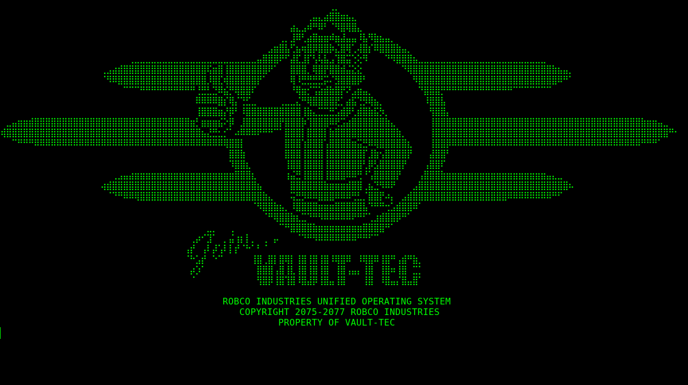
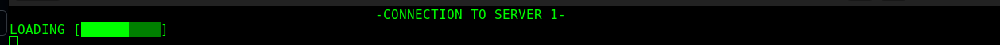
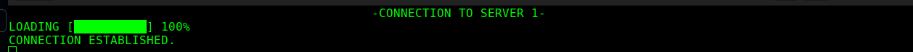
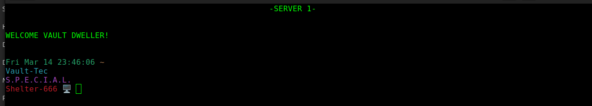

# Fallout Terminal Configuration

This project transforms your terminal into an immersive **Fallout**-inspired experience, with a customized prompt, the display of **Vault Boy ASCII art**, and Fallout-like colors. 

---

## Prerequisites

- A terminal supporting ANSI commands (e.g., **GNOME Terminal**, **Konsole**, **Alacritty**, etc.).
- Ability to edit your `.bashrc` file.

---

## Manual Installation

Follow the steps below to set up your Fallout-inspired terminal.

### 1. Resize the terminal window

To automatically resize your terminal window when you open it, you can modify the `.bashrc` file. This adjustment will ensure that your terminal always opens with a predefined window size of **40 rows** and **125 columns**, which is ideal for displaying the Fallout-inspired prompt and ASCII art.

Follow the steps below to make this change:

1. Open your terminal.
2. Edit the `.bashrc` file using your preferred text editor. You can use the following command to open it with **nano**:

   ```bash
     nano ~/.bashrc

3. Scroll at the end of the file and add the following line to resize the terminal window each time it starts:
    ```bash 
    # Resize terminal window to 40 rows and 125 columns
    echo -ne "\e[8;40;125t"

4. Save the changes and exit the editor. For nano, you can press CTRL + X, then Y to confirm the changes, and Enter to save.

To apply the changes, either close and reopen your terminal or run the following command:
    
    source ~/.bashrc

This will automatically resize your terminal window every time it starts, ensuring that the prompt and ASCII art are properly displayed without the need for manual resizing.

### 2. Add Vault Boy ASCII Art to the Terminal

In this step, we'll add the **Vault Boy ASCII Art** to your terminal so that it appears every time you open it. This will give your terminal the iconic Fallout theme from the very beginning.

Follow the steps below:

1. Open your terminal (if you haven’t already).
2. Edit the `.bashrc` file using your preferred text editor. Use the following command if you're using **nano**:
    ```bash
    nano ~/.bashrc
    ```

3. Scroll to the **bottom** of the file and add the following lines to display the Vault Boy ASCII art when you start the terminal:
   
    ```bash
    # Display Vault Boy ASCII Art
   echo "⠀⠀⠀⠀⠀⠀⠀⠀⠀⠀⠀⠀⠀⠀⠀⠀⠀⠀⠀⠀⠀⠀⠀⠀⠀⠀⠀⠀⠀⠀⠀⠀⠀⠀⠀⠀⠀⠀⠀⠀⠀⠀⠀⠀⠀⠀⠀⠀⠀⠀⠀⠀⠀⠀⠀⠀⠀⠀⠀⠀⢀⡀⠀⠀⠀⠀⠀⠀⠀⠀⠀⠀⠀⠀⠀⠀⠀⠀⠀⠀⠀⠀⠀⠀⠀⠀⠀⠀⠀⠀⠀⠀⠀⠀⠀⠀⠀⠀⠀⠀⠀⠀⠀⠀⠀⠀⠀⠀⠀⠀⠀⠀⠀⠀⠀⠀⠀⠀⠀⠀⠀⠀⠀"
   sleep 0.1
   echo "⠀⠀ ⠀⠀⠀⠀⠀⠀⠀⠀⠀⠀⠀⠀⠀⠀⠀⠀⠀⠀⠀⠀⠀⠀⠀⠀⠀⠀⠀⠀⠀⠀⠀⠀⠀⠀⠀⠀⠀⠀⠀⠀⠀⠀⠀⠀⠀⠀⠀⠀⠀⠀⠀⠀⠀⢀⣤⣄⣴⣿⣿⣶⣦⣄⠀⠀⠀⠀⠀⠀⠀⠀⠀⠀⠀⠀⠀⠀⠀⠀⠀⠀⠀⠀⠀⠀⠀⠀⠀⠀⠀⠀⠀⠀⠀⠀⠀⠀⠀⠀⠀⠀⠀⠀⠀⠀⠀⠀⠀⠀⠀⠀⠀⠀⠀⠀⠀⠀⠀⠀⠀⠀"
   sleep 0.1
   echo "⠀⠀⠀⠀⠀⠀⠀⠀⠀⠀⠀⠀⠀⠀⠀⠀⠀⠀⠀⠀⠀⠀⠀⠀⠀⠀⠀⠀⠀⠀⠀⠀⠀⠀⠀⠀⠀⠀⠀⠀⠀⠀⠀⠀⠀⠀⠀⠀⠀⠀⠀⠀⠀⣴⣄⣠⠾⠛⠿⠃⠈⠻⣿⢿⣿⣄⠀⠀⠀⠀⠀⠀⠀⠀⠀⠀⠀⠀⠀⠀⠀⠀⠀⠀⠀⠀⠀⠀⠀⠀⠀⠀⠀⠀⠀⠀⠀⠀⠀⠀⠀⠀⠀⠀⠀⠀⠀⠀⠀⠀⠀⠀⠀⠀⠀⠀⠀⠀⠀⠀⠀⠀⠀"
   sleep 0.1
   echo "⠀⠀⠀⠀⠀⠀⠀⠀⠀⠀⠀⠀⠀⠀⠀⠀⠀⠀⠀⠀⠀⠀⠀⠀⠀⠀⠀⠀⠀⠀⠀⠀⠀⠀⠀⠀⠀⠀⠀⠀⠀⠀⠀⠀⠀⠀⠀⠀⠀⠀⠀⢀⡀⣸⠿⢃⣴⣿⣶⣶⠾⣶⣼⣤⣤⠸⣧⠻⣷⣦⣤⡀⠀⠀⠀⠀⠀⠀⠀⠀⠀⠀⠀⠀⠀⠀⠀⠀⠀⠀⠀⠀⠀⠀⠀⠀⠀⠀⠀⠀⠀⠀⠀⠀⠀⠀⠀⠀⠀⠀⠀⠀⠀⠀⠀⠀⠀⠀⠀⠀⠀⠀⠀"
   sleep 0.1
   echo "⠀⠀⠀⠀⠀⠀⠀⠀⠀⠀⠀⠀⠀⠀⠀⠀⠀⠀⠀⠀⠀⠀⠀⠀⠀⠀⠀⠀⠀⠀⠀⠀⠀⠀⠀⠀⠀⠀⠀⠀⠀⠀⠀⠀⠀⠀⠀⠀⠀⣠⣶⣿⣧⢋⣦⢶⣿⡿⣿⣿⡷⣌⣿⢿⢁⢼⣿⡎⠿⣿⣿⣿⣷⣤⡀⠀⠀⠀⠀⠀⠀⠀⠀⠀⠀⠀⠀⠀⠀⠀⠀⠀⠀⠀⠀⠀⠀⠀⠀⠀⠀⠀⠀⠀⠀⠀⠀⠀⠀⠀⠀⠀⠀⠀⠀⠀⠀⠀⠀⠀⠀⠀⠀"
   sleep 0.1
   echo "⠀⠀⠀⠀⠀⠀⠀⠀⠀⠀⠀⠀⠀⠀⠀⠀⠀⠀⠀⠀⠀⠀⠀⠀⢀⣀⣀⣀⣀⣀⣀⣀⣀⣀⣀⣀⣀⣀⣀⣀⣀⣀⣀⣀⣀⣀⣀⣤⣿⣿⣿⠟⠋⣼⣏⣸⡏⢣⢧⣧⣠⢹⣿⣭⢑⢕⠻⠀⠀⠀⠙⠻⣿⣿⣿⣦⣀⣀⣀⣀⣀⣀⣀⣀⣀⣀⣀⣀⣀⣀⣀⣀⣀⣀⣀⣀⣀⣀⣀⠀⠀⠀⠀⠀⠀⠀⠀⠀⠀⠀⠀⠀⠀⠀⠀⠀⠀⠀⠀⠀⠀⠀⠀"
   sleep 0.1
   echo "⠀⠀⠀⠀⠀⠀⠀⠀⠀⠀⠀⠀⠀⠀⠀⠀⠀⠀⠀⢀⣠⣴⣾⣿⣿⣿⣿⣿⣿⣿⣿⣿⣿⣿⣿⣿⣿⣿⢯⣶⣿⢸⣿⣿⣿⣿⣿⣿⣿⠟⠁⠀⠀⣿⣿⣿⡀⢿⣿⡟⣿⣿⣾⣬⣕⣕⠀⠀⠀⠀⠀⠀⠀⠙⢿⣿⣿⣿⣿⣿⣿⣿⣿⣿⣿⣿⣿⣿⣿⣿⣿⣿⣿⣿⣿⣿⣿⣿⣿⣿⣷⣦⣤⡀⠀⠀⠀⠀⠀⠀⠀⠀⠀⠀⠀⠀⠀⠀⠀⠀⠀⠀⠀"
   sleep 0.1
   echo "⠀⠀⠀⠀⠀⠀⠀⠀⠀⠀⠀⠀⠀⠀⠀⠀⠀⠀⠀⠈⠻⠿⣿⣿⣿⣿⣿⣿⣿⣿⣿⣿⣿⣿⣿⣿⣿⣿⡸⣿⣏⢾⣿⣿⣿⣿⣿⡟⠁⠀⠀⠀⠀⢿⠸⣛⣛⣛⣛⡭⠌⣻⣿⣿⣿⡿⠃⠀⠀⠀⠀⠀⠀⠀⠀⠻⣿⣿⣿⣿⣿⣿⣿⣿⣿⣿⣿⣿⣿⣿⣿⣿⣿⣿⣿⣿⣿⣿⣿⣿⣿⠿⠛⠁⠀⠀⠀⠀⠀⠀⠀⠀⠀⠀⠀⠀⠀⠀⠀⠀⠀⠀⠀"
   sleep 0.1
   echo "⠀⠀⠀⠀⠀⠀⠀⠀⠀⠀⠀⠀⠀⠀⠀⠀⠀⠀⠀⠀⠀⠀⠀⠉⠉⠉⠛⠛⠛⠛⠛⠛⠛⠛⠛⠛⢘⣛⣃⣙⠿⣮⡛⢿⣿⣿⠏⠀⠀⠀⠀⠀⠀⠘⢿⣶⡊⢩⣵⣾⣷⣿⡟⠝⣠⣶⣤⡀⠀⠀⠀⠀⠀⠀⠀⠀⠙⣿⣿⣿⡛⠛⠛⠛⠛⠛⠛⠛⠛⠛⠛⠛⠛⠉⠉⠉⠉⠉⠉⠉⠀⠀⠀⠀⠀⠀⠀⠀⠀⠀⠀⠀⠀⠀⠀⠀⠀⠀⠀⠀⠀⠀⠀"
   sleep 0.1
   echo "⠀⠀⠀⠀⠀⠀⠀⠀⠀⠀⠀⠀⠀⠀⠀⠀⠀⠀⠀⠀⠀⠀⠀⠀⠀⠀⠀⠀⠀⠀⠀⠀⠀⠀⠀⠀⠿⠿⠿⠿⣿⡎⢿⡌⢙⣋⣀⠀⠀⠀⠀⢀⣀⣀⣌⠛⢿⣿⣿⣿⣿⣟⡁⣴⣯⢙⡻⢿⣦⡀⠀⠀⠀⠀⠀⠀⠀⠸⣿⣿⣧⠀⠀⠀⠀⠀⠀⠀⠀⠀⠀⠀⠀⠀⠀⠀⠀⠀⠀⠀⠀⠀⠀⠀⠀⠀⠀⠀⠀⠀⠀⠀⠀⠀⠀⠀⠀⠀⠀⠀⠀⠀⠀"
   sleep 0.1
   echo "⠀⠀⠀⠀⠀⠀⠀⠀⠀⠀⠀⠀⠀⠀⠀⠀⠀⠀⠀⠀⠀⠀⠀⠀⠀⠀⠀⠀⠀⠀⠀⠀⠀⠀⠀⠀⢸⣿⣿⣿⣶⡜⡿⠃⠸⣿⣿⣿⣿⣿⣿⣿⣿⣿⣿⢸⣷⣄⣉⣉⣛⣡⣾⡿⢃⣾⣿⣷⣯⡳⡀⠀⠀⠀⠀⠀⠀⠀⢻⣿⣿⡄⠀⠀⠀⠀⠀⠀⠀⠀⠀⠀⠀⠀⠀⠀⠀⠀⠀⠀⠀⠀⠀⠀⠀⠀⠀⠀⠀⠀⠀⠀⠀⠀⠀⠀⠀⠀⠀⠀⠀⠀⠀"
   sleep 0.1
   echo "⠀⠀⣀⣤⣶⣶⣾⣿⣿⣿⣿⣿⣿⣿⣿⣿⣿⣿⣿⣿⣿⣿⣿⣿⣿⣿⣿⣿⣿⣿⣿⣿⣿⣿⣿⣶⡃⣶⣶⣶⣮⠕⡿⠀⣸⣿⣿⣿⣿⣿⣿⡟⣿⣿⣿⡷⢹⣿⣿⣿⠿⢟⣩⣴⣿⣿⣿⣿⣿⣿⣷⣄⠀⠀⠀⠀⠀⠀⢸⣿⣿⣿⣿⣿⣿⣿⣿⣿⣿⣿⣿⣿⣿⣿⣿⣿⣿⣿⣿⣿⣿⣿⣿⣿⣿⣿⣿⣿⣿⣿⣿⣿⣿⣿⣿⣿⣷⣶⣶⣤⣀⠀⠀"
   sleep 0.1
   echo "⠐⢾⣿⣿⣿⣿⣿⣿⣿⣿⣿⣿⣿⣿⣿⣿⣿⣿⣿⣿⣿⣿⣿⣿⣿⣿⣿⣿⣿⣿⣿⣿⣿⣿⣿⣿⣿⣦⣜⣛⣂⡊⠁⠴⠿⠿⠿⠟⠛⠛⠉⠁⣿⣿⣿⡇⣿⣿⣿⡇⣷⣿⣿⣿⣿⣿⣿⣿⣿⣿⣿⣿⣷⡀⠀⠀⠀⠀⢸⣿⣿⣿⣿⣿⣿⣿⣿⣿⣿⣿⣿⣿⣿⣿⣿⣿⣿⣿⣿⣿⣿⣿⣿⣿⣿⣿⣿⣿⣿⣿⣿⣿⣿⣿⣿⣿⣿⣿⣿⣿⣿⠛⠂"
   sleep 0.1
   echo "⠀⠀⠀⠉⠛⠛⠛⠿⠿⠿⠿⠿⠿⠿⠿⠿⠿⠿⠿⠿⠿⠿⠿⠿⠿⠿⠿⠿⠿⠿⠿⠿⠿⠿⠿⠿⠿⠿⠿⠿⠿⢿⣿⣿⡇⠀⠀⠀⠀⠀⠀⠀⣿⣿⣿⢱⣿⣿⣿⢡⣿⣿⣿⣿⣶⣭⣛⠿⢿⣿⣿⣿⣿⣿⣆⠀⠀⠀⢸⣿⣿⡿⠿⠿⠿⠿⠿⠿⠿⠿⠿⠿⠿⠿⠿⠿⠿⠿⠿⠿⠿⠿⠿⠿⠿⠿⠿⠿⠿⠿⠿⠿⠿⠿⠿⠿⠛⠛⠛⠁⠀⠀⠀"
   sleep 0.1
   echo "⠀⠀⠀⠀⠀⠀⠀⠀⠀⠀⠀⠀⠀⠀⠀⠀⠀⠀⠀⠀⠀⠀⠀⠀⠀⠀⠀⠀⠀⠀⠀⠀⠀⠀⠀⠀⠀⠀⠀⠀⠀⠀⣿⣿⣷⠀⠀⠀⠀⠀⠀⠀⣿⣿⣿⢸⣿⣿⣿⢸⣿⣿⣿⣿⣿⣿⡏⣸⣷⢢⣿⣿⣿⣿⡟⠀⠀⠀⣼⣿⣿⠃⠀⠀⠀⠀⠀⠀⠀⠀⠀⠀⠀⠀⠀⠀⠀⠀⠀⠀⠀⠀⠀⠀⠀⠀⠀⠀⠀⠀⠀⠀⠀⠀⠀⠀⠀⠀⠀⠀⠀⠀⠀"
   sleep 0.1
   echo "⠀⠀⠀⠀⠀⠀⠀⠀⠀⠀⠀⠀⠀⠀⠀⠀⠀⠀⠀⠀⠀⠀⠀⠀⠀⠀⠀⠀⠀⠀⠀⠀⠀⠀⠀⠀⠀⠀⠀⠀⠀⠀⠹⣿⣿⣆⠀⠀⠀⠀⠀⠀⢸⣿⣿⢸⣿⣿⣿⢸⣿⣿⣿⣿⣿⣿⢃⡿⣣⣿⣿⣿⣿⡟⠀⠀⠀⢠⣿⣿⠏⠀⠀⠀⠀⠀⠀⠀⠀⠀⠀⠀⠀⠀⠀⠀⠀⠀⠀⠀⠀⠀⠀⠀⠀⠀⠀⠀⠀⠀⠀⠀⠀⠀⠀⠀⠀⠀⠀⠀⠀⠀⠀"
   sleep 0.1
   echo "⠀⠀⠀⠀⠀⠀⠀⠀⠀⠀⠀⠀⠀⠀⠀⠀⠀⠀⠀⠀⠀⢀⣠⣤⣴⣶⣶⣶⣶⣶⣶⣶⣶⣶⣶⣶⣶⣶⣶⣶⣶⣶⣶⣿⣿⣿⣆⠀⠀⠀⠀⠀⢰⣬⣛⢸⣿⣿⣿⢸⣿⣿⣿⠿⠿⢛⠘⢡⣿⣿⣿⣿⡟⠀⠀⠀⢠⣿⣿⣿⣷⣶⣶⣶⣶⣶⣶⣶⣶⣶⣶⣶⣶⣶⣶⣶⣶⣶⣶⣤⣄⣀⠀⠀⠀⠀⠀⠀⠀⠀⠀⠀⠀⠀⠀⠀⠀⠀⠀⠀⠀⠀⠀"
   sleep 0.1
   echo "⠀⠀⠀⠀⠀⠀⠀⠀⠀⠀⠀⠀⠀⠀⠀⠀⠀⠀⠀⢴⣾⣿⣿⣿⣿⣿⣿⣿⣿⣿⣿⣿⣿⣿⣿⣿⣿⣿⣿⣿⣿⣿⣿⣿⣿⣿⣿⣦⠀⠀⠀⠀⠀⣿⣿⣿⣿⣿⣿⣷⣶⣶⣶⣾⣿⣿⢀⣦⣙⠻⠿⠟⠀⠀⠀⣠⣿⣿⣿⣿⣿⣿⣿⣿⣿⣿⣿⣿⣿⣿⣿⣿⣿⣿⣿⣿⣿⣿⣿⣿⣿⣿⣿⠦⠀⠀⠀⠀⠀⠀⠀⠀⠀⠀⠀⠀⠀⠀⠀⠀⠀⠀⠀"
   sleep 0.1
   echo "⠀⠀⠀⠀⠀⠀⠀⠀⠀⠀⠀⠀⠀⠀⠀⠀⠀⠀⠀⠀⠈⠙⠛⠿⠿⢿⣿⣿⣿⣿⣿⣿⣿⣿⣿⣿⣿⣿⣿⣿⣿⣿⣿⣿⣿⣿⣿⣿⣷⣄⠀⠀⠀⢭⣛⡻⠿⠿⣿⣿⣿⠿⠿⠿⢛⣃⡈⣿⣿⡟⠴⡄⠀⣠⣾⣿⣿⣿⣿⣿⣿⣿⣿⣿⣿⣿⣿⣿⣿⣿⣿⣿⠿⠿⠿⠿⠿⠿⠿⠿⠛⠋⠀⠀⠀⠀⠀⠀⠀⠀⠀⠀⠀⠀⠀⠀⠀⠀⠀⠀⠀⠀⠀"
   sleep 0.1
   echo "⠀⠀⠀⠀⠀⠀⠀⠀⠀⠀⠀⠀⠀⠀⠀⠀⠀⠀⠀⠀⠀⠀⠀⠀⠀⠀⠀⠀⠀⠀⠀⠀⠀⠀⠀⠀⠀⠀⠀⠀⠀⠀⠀⠀⠀⠀⠈⠻⣿⣿⣷⣦⡀⠸⣿⣿⣿⣿⣶⣶⣶⣿⣿⣿⣿⣿⣧⠙⠛⠛⢒⣡⣾⣿⣿⠿⠁⠀⠀⠀⠀⠀⠀⠀⠀⠀⠀⠀⠀⠀⠀⠀⠀⠀⠀⠀⠀⠀⠀⠀⠀⠀⠀⠀⠀⠀⠀⠀⠀⠀⠀⠀⠀⠀⠀⠀⠀⠀⠀⠀⠀⠀⠀"
   sleep 0.1
   echo "⠀⠀⠀⠀⠀⠀⠀⠀⠀⠀⠀⠀⠀⠀⠀⠀⠀⠀⠀⠀⠀⠀⠀⠀⠀⠀⠀⠀⠀⠀⠀⠀⠀⠀⠀⠀⠀⠀⠀⠀⠀⠀⠀⠀⠀⠀⠀⠀⠈⠛⢿⣿⣿⣷⣆⣉⠙⠛⠻⠿⠿⠿⠿⠿⠟⠛⠋⢁⣰⣾⣿⣿⡿⠛⠁⠀⠀⠀⠀⠀⠀⠀⠀⠀⠀⠀⠀⠀⠀⠀⠀⠀⠀⠀⠀⠀⠀⠀⠀⠀⠀⠀⠀⠀⠀⠀⠀⠀⠀⠀⠀⠀⠀⠀⠀⠀⠀⠀⠀⠀⠀⠀⠀"
   sleep 0.1
   echo "⠀⠀⠀⠀⠀⠀⠀⠀⠀⠀⠀⠀⠀⠀⠀⠀⠀⠀⠀⠀⠀⠀⠀⠀⠀⠀⠀⠀⠀⠀⠀⠀⠀⠀⠀⠀⠀⠀⣀⡀⠀⠀⢀⠀⠀⠀⠀⠀⠀⠀⠀⠉⠛⣿⣿⣿⣿⣷⣶⣶⣶⣶⣶⣶⣶⣶⣿⣿⣿⣿⠛⠁⠀⠀⠀⠀⠀⠀⠀⠀⠀⠀⠀⠀⠀⠀⠀⠀⠀⠀⠀⠀⠀⠀⠀⠀⠀⠀⠀⠀⠀⠀⠀⠀⠀⠀⠀⠀⠀⠀⠀⠀⠀⠀⠀⠀⠀⠀⠀⠀⠀⠀⠀"
   sleep 0.1
   echo "⠀⠀⠀⠀⠀⠀⠀⠀⠀⠀⠀⠀⠀⠀⠀⠀⠀⠀⠀⠀⠀⠀⠀⠀⠀⠀⠀⠀⠀⠀⠀⠀⠀⠀⠀⢀⡴⠊⣹⠁⠀⡀⣬⢰⡆⡇⡀⠀⢀⠀⡤⠀⠀⠀⠈⠙⠛⠻⠿⠿⠿⠿⠿⠿⠿⠛⠛⠋⠉⠀⠀⠀⠀⠀⠀⠀⠀⠀⠀⠀⠀⠀⠀⠀⠀⠀⠀⠀⠀⠀⠀⠀⠀⠀⠀⠀⠀⠀⠀⠀⠀⠀⠀⠀⠀⠀⠀⠀⠀⠀⠀⠀⠀⠀⠀⠀⠀⠀⠀⠀⠀⠀⠀"
   sleep 0.1
   echo "⠀⠀⠀⠀⠀⠀⠀⠀⠀⠀⠀⠀⠀⠀⠀⠀⠀⠀⠀⠀⠀⠀⠀⠀⠀⠀⠀⠀⠀⠀⠀⠀⠀⠀⢠⡞⠀⢠⠇⡼⢡⠇⡇⡞⠈⠓⠁⠃⠈⠀⠀⠀⠀⠀⠀⠀⠀⠀⠀⠀⠀⠀⠀⠀⠀⠀⠀⠀⠀⠀⠀⠀⠀⠀⠀⠀⠀⠀⠀⠀⠀⠀⠀⠀⠀⠀⠀⠀⠀⠀⠀⠀⠀⠀⠀⠀⠀⠀⠀⠀⠀⠀⠀⠀⠀⠀⠀⠀⠀⠀⠀⠀⠀⠀⠀⠀⠀⠀⠀⠀⠀⠀⠀"
   sleep 0.1
   echo "⠀⠀⠀⠀⠀⠀⠀⠀⠀⠀⠀⠀⠀⠀⠀⠀⠀⠀⠀⠀⠀⠀⠀⠀⠀⠀⠀⠀⠀⠀⠀⠀⠀⠀⠈⠓⣡⡞⠀⠑⠉⠀⠀⠀⠀⠀⢸⣿⢀⣿⡇⣿⢿⡇⢸⣿⢸⣿⢸⣿⠸⢿⣿⠿⠀⠸⢿⣿⠿⢸⣿⠛⢠⣾⠛⣷⡀⠀⠀⠀⠀⠀⠀⠀⠀⠀⠀⠀⠀⠀⠀⠀⠀⠀⠀⠀⠀⠀⠀⠀⠀⠀⠀⠀⠀⠀⠀⠀⠀⠀⠀⠀⠀⠀⠀⠀⠀⠀⠀⠀⠀⠀⠀"
   sleep 0.1
   echo "⠀⠀⠀⠀⠀⠀⠀⠀⠀⠀⠀⠀⠀⠀⠀⠀⠀⠀⠀⠀⠀⠀⠀⠀⠀⠀⠀⠀⠀⠀⠀⠀⠀⠀⠀⡴⡱⠁⠀⠀⠀⠀⠀⠀⠀⠀⠀⣿⣿⣿⢠⣿⢸⣇⢸⣿⢸⣿⢸⣿⠀⢸⣿⢠⣤⡄⢸⣿⠀⢸⣿⠶⢸⣿⠀⣉⡁⠀⠀⠀⠀⠀⠀⠀⠀⠀⠀⠀⠀⠀⠀⠀⠀⠀⠀⠀⠀⠀⠀⠀⠀⠀⠀⠀⠀⠀⠀⠀⠀⠀⠀⠀⠀⠀⠀⠀⠀⠀⠀⠀⠀⠀⠀"
   sleep 0.1
   echo "⠀⠀⠀⠀⠀⠀⠀⠀⠀⠀⠀⠀⠀⠀⠀⠀⠀⠀⠀⠀⠀⠀⠀⠀⠀⠀⠀⠀⠀⠀⠀⠀⠀⠀⠀⠈⠀⠀⠀⠀⠀⠀⠀⠀⠀⠀⠀⢻⣿⡿⢸⣿⢹⣿⠸⣿⣼⡿⢸⣿⣤⢸⣿⠀⠀⠀⢸⣿⠀⠸⣿⣤⡌⣿⣤⣿⠁⠀⠀⠀⠀⠀⠀⠀⠀⠀⠀⠀⠀⠀⠀⠀⠀⠀⠀⠀⠀⠀⠀⠀⠀⠀⠀⠀⠀⠀⠀⠀⠀⠀⠀⠀⠀⠀⠀⠀⠀⠀⠀⠀⠀⠀⠀"
   sleep 0.1
   echo ""
    ```

These `echo` commands will print the Vault Boy ASCII art line by line and these `sleep` commands will add an effect of progressive rendering, making the drawing appear gradually.

4. If you want to be more realistic, you can add details such as the company name, copyright dates, and ownership statement just after the display of Vault-boy:
    ```bash
    sleep 1
    echo "                                         ROBCO INDUSTRIES UNIFIED OPERATING SYSTEM"
    echo "                                            COPYRIGHT 2075-2077 ROBCO INDUSTRIES"
    echo "                                                   PROPERTY OF VAULT-TEC"
    sleep 2
    clear

This mimics the classic boot-up screen of ROBCO Industries Unified Operating System, for an immersive Fallout aesthetic.

5. Save the changes and exit the editor. In **nano**, press **CTRL + X**, then **Y** to confirm the changes, and press **Enter** to save.

Once you’ve completed this step, every time you open a new terminal session, the Vault Boy ASCII Art will appear, giving your terminal that familiar Fallout vibe!



### 3. Add a loading page

Now we can add a loading page like for the connection to a serveur, for example the shelter's serveur, with an animated loading bar:

1. Defining the Loading Bar Sequence

The `loading_bar` array holds a sequence of strings that represent different stages of the loading bar. Each string contains a combination of filled (█) and empty (▒) blocks that gradually fill up as the loop progresses. Here's the array definition:
    
    loading_bar=("█▒▒▒▒▒▒▒▒▒" "██▒▒▒▒▒▒▒▒" "███▒▒▒▒▒▒▒" "████▒▒▒▒▒▒"
                 "█████▒▒▒▒▒" "██████▒▒▒▒" "███████▒▒▒" "████████▒▒"
                 "█████████▒" "██████████")

This sequence will be used in the loop to simulate the loading process.

2. Loading Animation Loop

The `for` loop iterates through each element of the `loading_bar` array. At each step:
   
   -The screen is cleared with `clear` to simulate a real-time animation.
   
   -The message "LOADING" along with the current loading bar is printed.
   
   -The script pauses for `0.3` seconds using `sleep 0.3` to create the animation effect.
    
      for i in "${loading_bar[@]}"; do
          clear
          echo "                                              -CONNECTION TO SERVER 1-"
          echo "LOADING [$i]"
          sleep 0.3
      done



3. Completion of Loading Process

After the loop finishes, the loading bar reaches its final state (██████████), and the script prints the message indicating that the connection is established:

    clear
    echo "                                              -CONNECTION TO SERVER 1-"
    echo "LOADING [██████████] 100%"
    sleep 0.3
    echo ""
    echo "CONNECTION ESTABLISHED."



4. Clearing the Screen and Displaying the Welcome Message

Once the connection is established, the screen is cleared again, and the script prints a message saying "WELCOME VAULT DWELLER!", which adds a nice touch to the simulation:
    
    clear
    echo "                                                        -SERVER 1-"
    sleep 1
    echo ""
    echo ""
    echo "WELCOME VAULT DWELLER!"
    sleep 1
    echo ""
    echo ""

### 4. Customize the Terminal Prompt

In this step, we'll customize your terminal prompt to display a **Fallout-inspired prompt**, including the current date, working directory, and a reference to Vault-Tec and your shelter number.

Follow the steps below:

1. Open your terminal (if not already open).
2. Edit the `.bashrc` file using your preferred text editor. If you're using **nano**, use the following command:
    ```bash
   nano ~/.bashrc
    ```

3. Scroll to the **bottom** of the file and add the following line to set your custom Fallout-themed prompt:
    ```bash

    # Set Fallout-inspired terminal prompt
    PS1='\[\e[32m\]$(date "+%a %b %d %T") \[\e[33m\]\w\n\[\e[36m\]Vault-Tec\n\[\e[35m\]S.P.E.C.I.A.L.\n\[\e[31m\]Shelter-666 🖥️  \[\e[0m\]'
    ```

    - **Explanation of the prompt**:
        - `$(date "+%a %b %d %T")` will display the current date and time in the format **Day Month Date Time** (e.g., **Fri Mar 14 15:14:52**).
        - `\w` will display the current working directory (the folder you're currently in).
        - `Vault-Tec` and `S.P.E.C.I.A.L.` are static text lines that give your terminal the Fallout vibe.
        - `Shelter-666 🖥️` shows your shelter number (you can change `666` to any other number) along with an **emoji** of a computer.
        - The colors for different parts of the prompt are set using ANSI escape codes:
            - **Green (`\[\e[32m\]`)** for the date.
            - **Yellow (`\[\e[33m\]`)** for the current working directory.
            - **Cyan (`\[\e[36m\]`)** for Vault-Tec.
            - **Magenta (`\[\e[35m\]`)** for S.P.E.C.I.A.L.
            - **Red (`\[\e[31m\]`)** for the shelter name with the computer emoji.
            - **Reset (`\[\e[0m\]`)** to reset the colors back to the default after the prompt.



4. Once you've added the line, **save** the changes and **exit** the editor. If you're using **nano**, press **CTRL + X**, then **Y** to confirm the changes, and press **Enter** to save.

Now, every time you open your terminal, you will see the **Fallout-themed prompt** with the current date, your working directory, Vault-Tec branding, S.P.E.C.I.A.L. stats, and your shelter number.

This will give your terminal a truly immersive Fallout experience right from the start!

### 5. Change the Text and Background Color to Green (#00FF00) and Black (#000000)

While Bash allows you to change the text and background colors using ANSI escape codes, some settings, like the color of the cursor or text and background settings in specific terminals, require you to modify the terminal's graphical preferences.

Since changing the **cursor color** or setting a default text and background color isn't possible purely through Bash, we will focus on **manually setting these colors through your terminal preferences**. Below are the instructions to set the terminal text color to **green** (`#00FF00`) and the background color to **black** (`#000000`):

#### Steps to Change Text and Background Colors in GNOME Terminal (Example)

1. **Open the GNOME Terminal** (or your preferred terminal application).
2. **Access the terminal preferences**:
   - In **GNOME Terminal**, click on the **three horizontal bars** (hamburger icon) in the top-right corner of the window, and select **Preferences**.
   
   - For **other terminals** (like **Konsole** or **Alacritty**), look for a similar settings or preferences option.
   
3. **Choose the Profile** you are using (often called **Unnamed** by default).
   
4. **Go to the Colors Tab**:
   - You will see a section labeled **Text and Background** or **Color Scheme**.
   - In this section, **uncheck** the box labeled **Use colors from system theme** to make the colors customizable.
   
5. **Set the Text Color**:
   - Find the color picker or the input box labeled **Text color**.
   - Set the text color to **green** using the hexadecimal color code `#00FF00`.

6. **Set the Background Color**:
   - Find the color picker or input box labeled **Background color**.
   - Set the background color to **black** using the hexadecimal color code `#000000`.

7. **Save and Exit**:
   - After changing the colors, simply close the preferences window. Your terminal should now display the **green text** on a **black background** by default.

#### Example for GNOME Terminal:
1. Open GNOME Terminal and go to **Preferences** → **Profile** → **Colors**.
2. Set **Text color** to `#00FF00` (green).
3. Set **Background color** to `#000000` (black).

#### Why Can't We Do This in `.bashrc`?

Unfortunately, terminal colors like text and background colors are set via the **terminal's graphical interface**, not through Bash. In `.bashrc`, we can change **the color of the terminal's output (text)**, but we can't change the default background or the cursor color, as those are managed by the terminal's graphical settings.

That's why, for **consistent styling**, you'll need to manually adjust these settings in the terminal preferences. Once this is done, your terminal should open with a **green text on a black background**, and this will remain even after you restart the terminal.

## Automatic Installation (if you are lazy)

### 1. Clone the repo

    git clone https://github.com/LeonardLeroy/Fallout-Terminal-Configuration.git Fallout_Config_Terminal

And go to the folder

    cd Fallout_Config_Terminal


### 2. Make the script executable
   
    chmod +x add_config.sh

### 3. Run the script

    ./add_config.sh
      
### This will append the content of config_to_add to your ~/.bashrc file automatically.

### 4. Apply changes

      source ~/.bashrc

Now, your new configuration is active! 🚀
# (some updates coming soon..)
